英伟达工程师分享讲座笔记
- 原视频链接:  https://www.youtube.com/watch?v=Na9_2G6niMw

# 一些常见的 GPU 加速库
GPU加速库举例
- cuBLAS: 线性代数的加速库, 包含向量, 矩阵运算的加速
- cuDNN: 神经网络的加速库
- cuFFT: 傅里叶变换的加速库 
- Thrust: 用cuda实现的STL加速库(标准库函数的加速)
  - 后续会有其他分支的库出现
- cuRAND: GPU上生成随机数的库
- cuSOLVER: 解决方程组的一些库

## OpenACC库的例子

- 这个例子是加速两个向量进行对应元素相加的代码
  - OpenACC 是通过一些引导语句告诉编译器, 让编译器完成并行化处理的一个库. 它是在CPU代码的基础上直接进行`增量代码的编写`完成加速的.

- `pragma acc data copyin(a,b) copyout(c)`: 告诉编译器哪些数据需要移动
- `pragma acc parallel`: 告诉编译器从此处开始执行并行化
- `pragma acc loop gang vector`: 精细化地告诉编译器用什么方法进行加速, 是使用 `gang vector`还是其他什么别的方法.

## 关于CPU与GPU架构的区别

一些英文缩写含义:
  - ALU: 运算单元
  - Lxxx: 高速缓存/寄存器

- 从图中可以看到, CPU的计算单元特别少, 而缓存区域特别大, 这表明CPU是一种`针对任数据读取时间有特殊优化的架构`, 同时也说明`CPU更看重单个任务/单个线程的执行时间优化`.
- GPU的架构是以计算单元为主的结构, 它的数据缓冲区L2并不大, 这表明GPU是一种`针对多线程并行计算`的结构, 它能同时开启非常多`能进行简单计算的线程`, 但GPU并没有针对数据的读取进行额外的优化.
  - 多线程同时执行可以在一定程度掩盖单线程的执行延迟
  - 多线程同时并发可以增大整体的数据吞吐量 (对吞吐量进行了针对性优化).

### CPU vs GPU: 选择多线程还是低延迟?
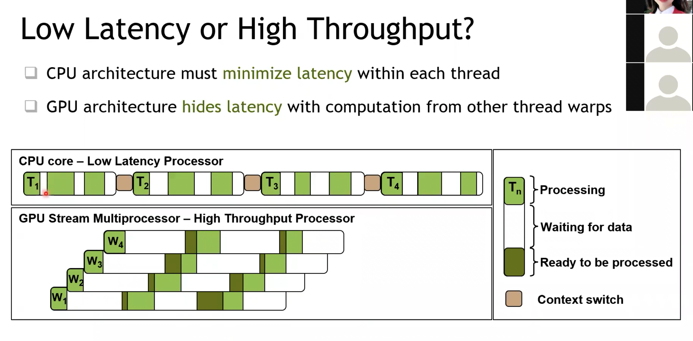
- 绿色区域之间夹着的白色区域表示当前器件`等待数据读取的时间`
- 橙棕色区域是`context Switch`的时间, 由于GPU 的流处理器(stream multiprocessor)执行的时同一个任务, 因此GPU没有context switch, 而cpu的不同线程执行的是不同的任务, 因此存在一个较长的 context switch时间.

### GPU的 high level 结构解析
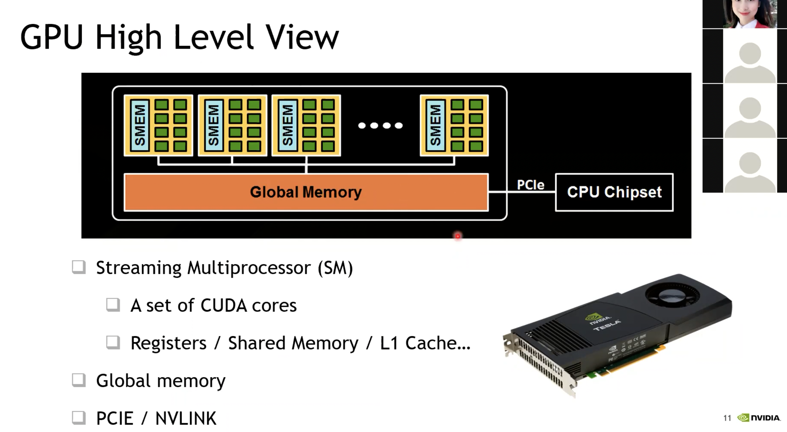

- 绿色部分是 CUDA core, 也就是类似于 CPU的ALU概念差不多的`计算单元`
- 每一个流处理器(Streaming Multiprocessor, SM) 会包含很多个 CUDA Core, 并且这些 SM 上会有一个`片上的缓存, L1缓存`
- SM外面连接着`全局内存(global memory)`, 它不在芯片上, 而是在芯片外的电路板上, 也就是我们常说的`显存`.
- 显存通过PCIe连接到CPU上, 以此与CPU通信并接受CPU的控制.

GV100显卡的结构图例子:

- 在这款显卡中, 一个 SM 里面有四个 sub-core(子核心)
- L0 instruction Cache: 存放指令
- warp scheduler 和 Dispatch Unit: 俗称"前端", 用于选择指令并发送到"后端"执行
- register file: 在一个 sub-core 里所有计算单元都能直接访问到的数据(存放在这里寄存器中).
  - GPU里的片上寄存器都是`32-bit (32位)`的, SM里的每个`register file`寄存器有16k个这样的地址访问单元(或者直接叫32位寄存器), 所以`整个SM就有 64K 个 32-bit 寄存器`
- Tensor core 是针对深度学习引入的加速内核

- L1 instruction cache: 四个sub-core共享的指令存储缓冲区
- 128KB L1 Data cache: 128KB 缓冲区, 这个地方是用户自定义可配置为 `L1 data cache` 或 `shared memory`
- Tex: texture纹理单元, 主要用于图形学里的图像纹理处理(在深度学习里, 它其实对应的是 2维, 3维数据, 也就是那些神经元传递的tensor)
- FP32 unit: FP32单元(浮点运算单元), 它在每个时钟周期可以完成一次`FMA, 即乘加融合指令`, 也就是两个flop(两次浮点运算操作)
- FP64 unit: FP64单元, 它也是每个时钟周期能完成一次 FMA (2次浮点运算), 不同的是它操作的数据是64 bit的.
- active threads: 这一个SM单元最多能容纳**2048个CUDA线程同时激活**, 因为每一个sub-core最大可以激活 32 个线程.

# Tensor Core介绍
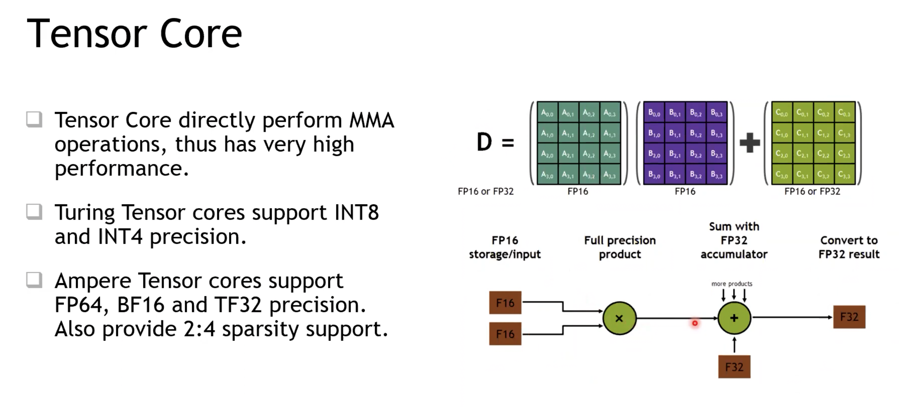
- CUDA core: 完成两个浮点数的`相乘 和 相加`, 也就是包含了两次浮点运算. 
  - 这是`标量`的乘加.
- tensor core: 先完成`两个2D matrix相乘`, 然后再`与第三个2D matrix相加`
  - 这是`矩阵的乘加`.
  - 注意相乘的矩阵的数据精度是`FP16`, 相加的矩阵数据精度是`FP32`, 目标矩阵是 float 32的 (但同时也支持 所有操作都是 FP16)
- 对于GV100显卡, 它的tensor core一个时钟周期内能完成`4*4的矩阵`的乘加运算. 
- 对于 ampere (安培架构, 30系列显卡): tensor core 支持到 FP64(双精度), BF16(也就是E8M7, 8个指数位,7个小数位) 和 TF32(E8M10, 8个指数位, 10个小数位) 的精度
  - 数据类型说明的参考博客: https://blog.csdn.net/weixin_43969854/article/details/124185741 
- sparsity: 这里提到了`2:4的矩阵结构化稀疏性`, 它指的是`作为操作数的原矩阵中, 每4个元素里要求有2个元素为0`.
  - 注意在这样的稀疏化结构中, tensor core 有一半的K方向是没有使用的(有一半算力没有使用), 因此输入这种稀疏矩阵时, GPU的整体的"有效吞吐量"会再翻一倍.

# GPU上的内存层级
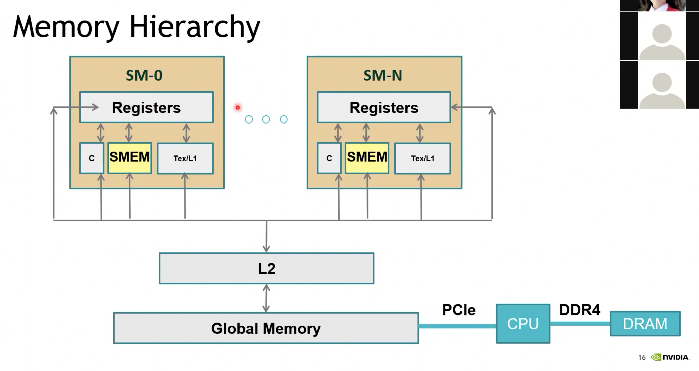
- c: 这里代表 const, 也就是常量的缓冲区, 专门存放一些常量, 我们不需要特地去手动操作它, 编译器在调用 kernel函数的时候会自动完成.
  - 传的 size_t, 传给kernel function的参数可能会传递到这个寄存器中
- registers: 这里想强调的是, 它读取数据的延时大概在`一个时钟周期`
- SEME: shared memory: 这里强调的是一个 SM 里的 sub-core 上设计了一个`片上(on-chip)的共享缓冲区`, 提供给这个 sub-core 上的线程共用, 以达到更快的数据读取效果
- Tex/L1: 如果我们没有配置这个 shared memory的比例, GPU会自动将一些比较 hard 的数据存放到 L1 cache里面 (前面的图中提到过这部分内存配比是可以用户自定义的) 
- L2: 注意它也是 on-chip 的缓存, 真个芯片的所有SM会通过一个`片上网络`来访问L2缓存
- global memory: 片外缓存, 也就是显存, 它的带宽是明显低于片上的缓存的, 延迟也是更高的(可达几百纳秒).
- 注意: 整个 GPU chip 上所有单元如果要访问 global memory都需要经过L2!!!
  - 确保了数据的一致性 (或者说保证了数据的原子性)
  - L2 缓存的带宽是 global memory 的`3倍`左右, 延迟也比 global memory `低3倍`, 但是L2 的延迟要比SEME这种要`高出3~5倍`

# 多卡环境 -- NVLINK总线

- 每一个绿色箭头代表一个 nvlink, `每一个 nvlink总线 能提供40GB/s的双向带宽`
- 右侧倍挡住的部分想说的是 IBM的Power机器, 这种机器能通过nvlink直接与CPU通信. 左侧的图是常用的 x86 的机器.

NVSwitch结构 -- 解决此前多卡无法实现全连接的问题
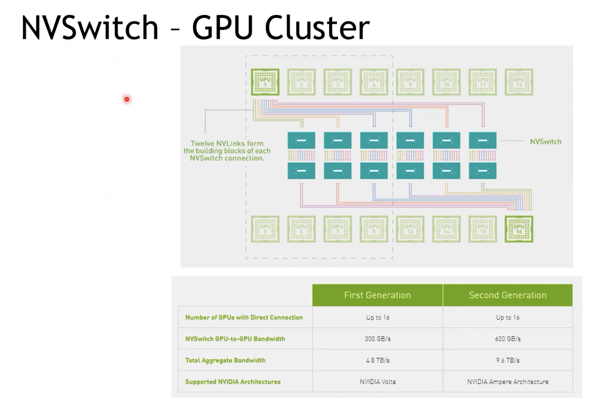
- 如果多卡无法实现点对点的`全连接`, 就会出现通信延迟等问题.
- 这里增加的是 NVSwitch 芯片, 它是一个类似`交换机`概念的一个器件, 它最多支持`单机16卡的点对点连接`

# GPU型号与 SM version
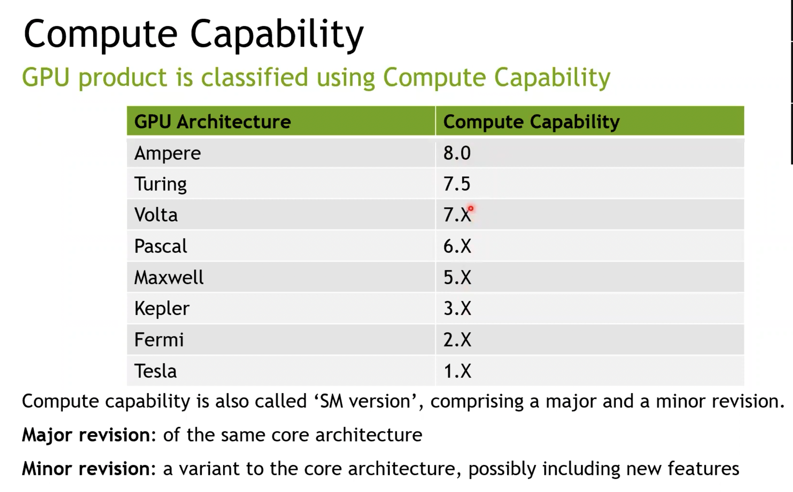
- SM version指的是`指令集`版本号
- 尽可能使用volta以上的卡, 前面的卡会逐渐淘汰

# CUDA编程基础

## 环境
- 需要下载并安装 cuda toolkit

## cuda编程的"大纲"
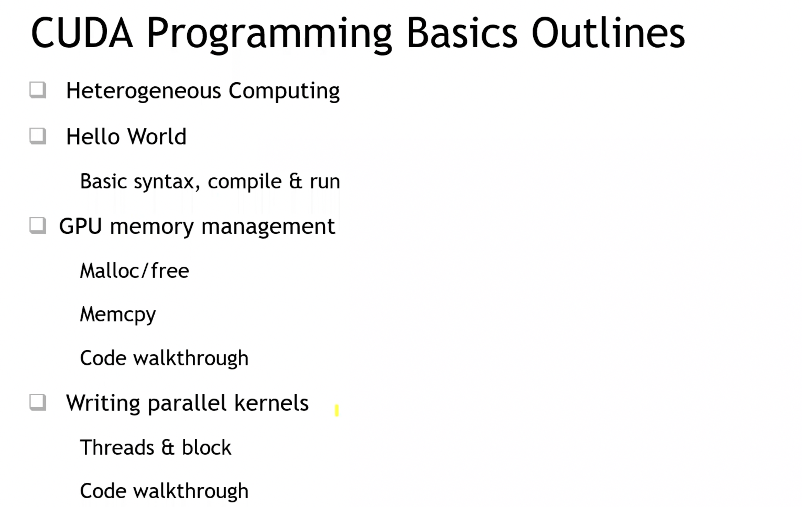

### 异构编程
- cuda 属于一种异构编程, 我们既要对CPU进行编程, 也要对GPU进行编程
  

### CUDA kernels
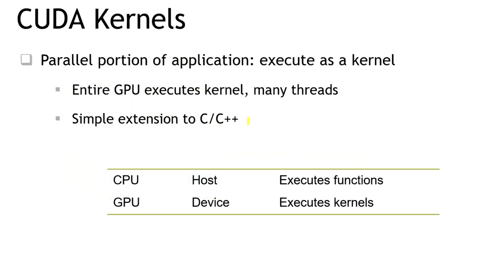
- CUDA核函数: 可以简单理解为GPU里多个线程都会执行的函数(这个函数会被拷贝很多份, 然后通过不同线程去执行)

### CPU与GPU执行的HelloWorld程序对比
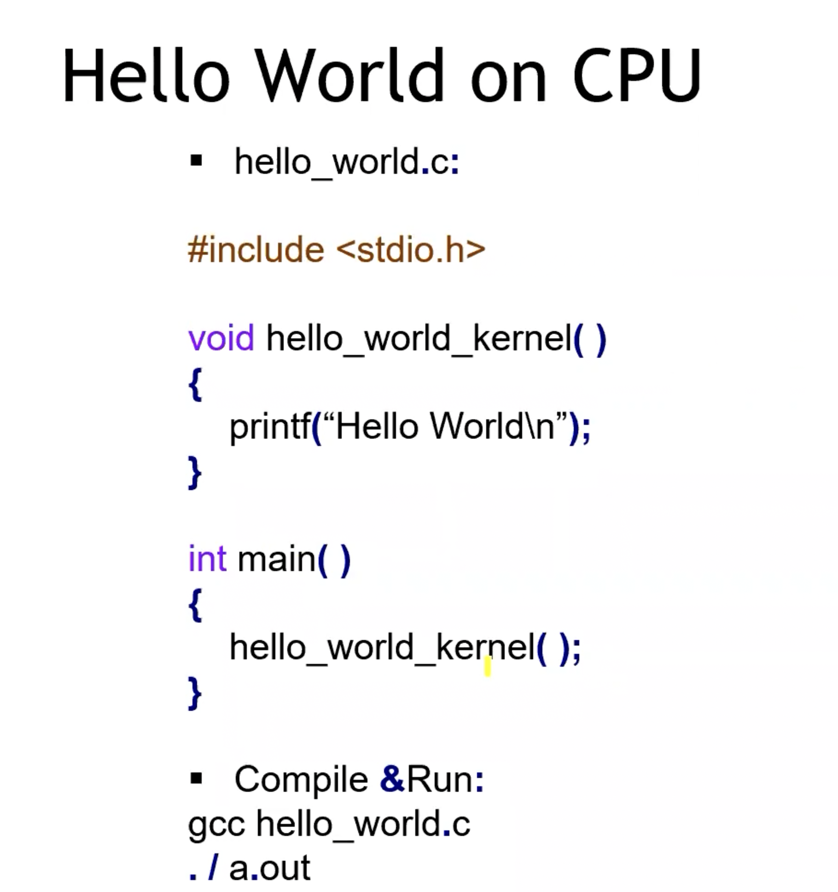

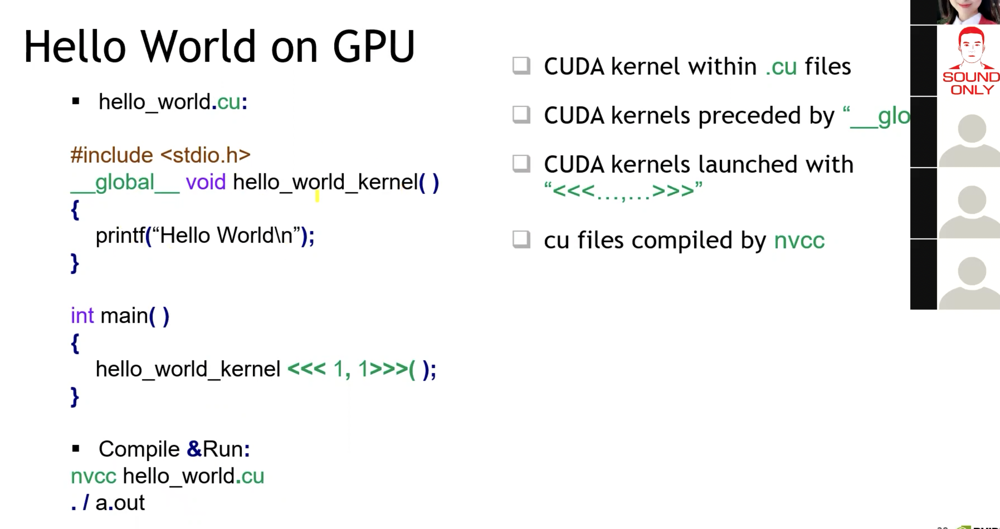
`__global__`: 
1. 告诉编译器, 这个函数是GPU函数的入口点;
2. 编译器要把这个函数体编译成GPU执行代码
3. 这段代码需要具备从`CPU代码调用的能力`

main函数:
1. 调用kernel函数的时候, 需要增加`<<< , >>>` 这样的参数列表, 称为`launch configuration` 
   1. 告诉编译器, 这个函数是一个kernel function
   2. 告诉编译器, 这个GPU函数需要有多少个副本去运行

文件后缀: 
- 从`.cpp` --> `.cu`

编译: 
- 使用`nvcc`编译(方式很像`g++`), 然后默认会生成`a.out`文件, 此时可以直接`./a.out` 执行编译好的文件

## GPU/CUDA的内存分配与释放
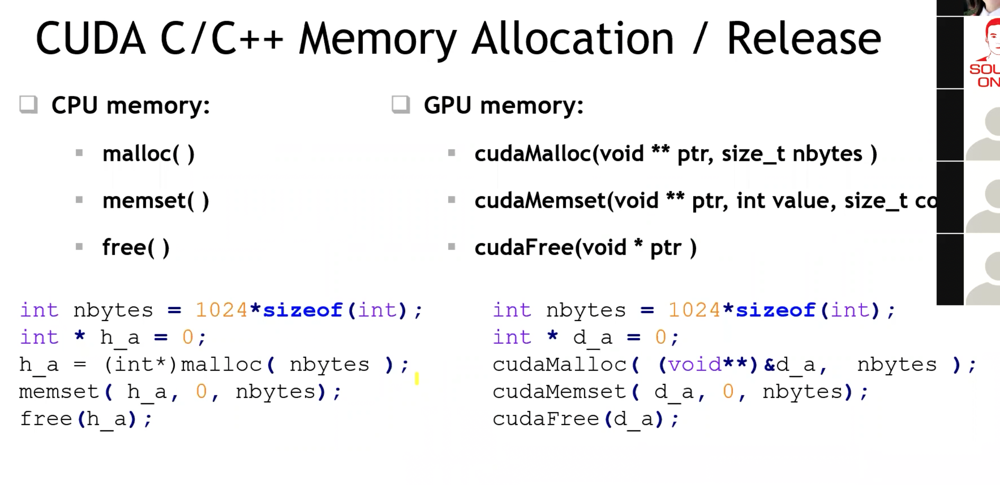
- C++中:
  - malloc(): 分配内存
  - memset(): 将内存空间初始化为指定值
  - free(): 释放内存块

- 对应到GPU中:
  - cudaMalloc(void **ptr, size_t nbytes)
    - 它分配出来的空间`仅限GPU访问, CPU是无法访问的`!!!
  - cudaMemset(void **ptr, int value, size_t nbytes)
    - 注意这个函数的执行是`异步的`, 也就是这个函数return的时候, 它并不一定 memset 完成!!!
  - cudaFree(void * ptr)

## CPU/GPU的数据拷贝(数据传输)
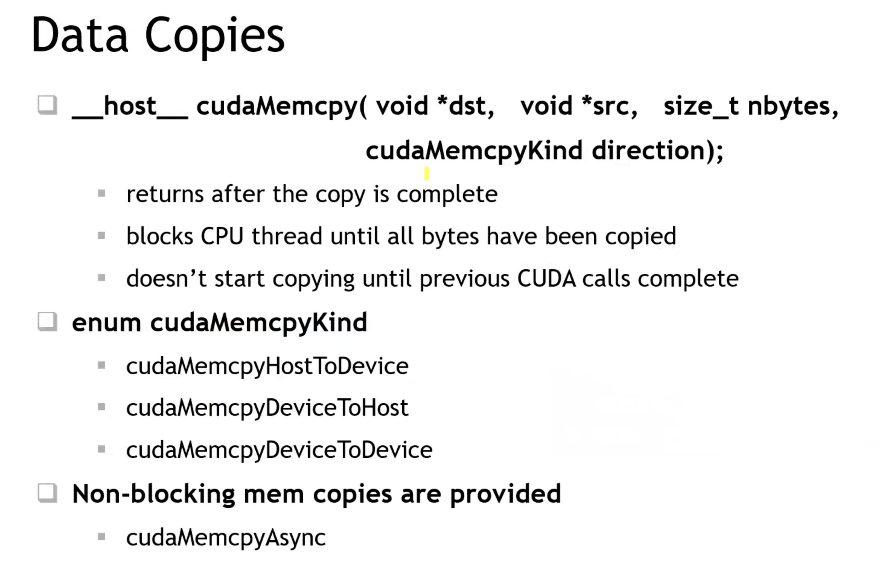

