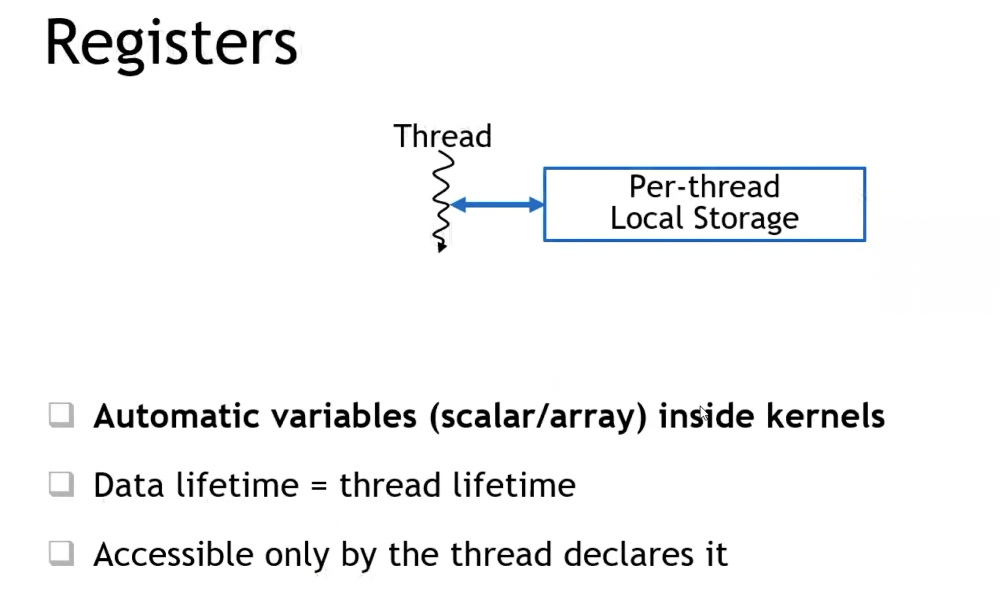

英伟达工程师分享讲座笔记
- 原视频链接:  https://www.youtube.com/watch?v=Na9_2G6niMw


# 一些常见的 GPU 加速库
GPU加速库举例
- cuBLAS: 线性代数的加速库, 包含向量, 矩阵运算的加速
- cuDNN: 神经网络的加速库
- cuFFT: 傅里叶变换的加速库 
- Thrust: 用cuda实现的STL加速库(标准库函数的加速)
  - 后续会有其他分支的库出现
- cuRAND: GPU上生成随机数的库
- cuSOLVER: 解决方程组的一些库


## OpenACC库的例子

- 这个例子是加速两个向量进行对应元素相加的代码
  - OpenACC 是通过一些引导语句告诉编译器, 让编译器完成并行化处理的一个库. 它是在CPU代码的基础上直接进行`增量代码的编写`完成加速的.

- `pragma acc data copyin(a,b) copyout(c)`: 告诉编译器哪些数据需要移动
- `pragma acc parallel`: 告诉编译器从此处开始执行并行化
- `pragma acc loop gang vector`: 精细化地告诉编译器用什么方法进行加速, 是使用 `gang vector`还是其他什么别的方法.


## 关于CPU与GPU架构的区别


一些英文缩写含义:
  - ALU: 运算单元
  - Lxxx: 高速缓存/寄存器

- 从图中可以看到, CPU的计算单元特别少, 而缓存区域特别大, 这表明CPU是一种`针对任数据读取时间有特殊优化的架构`, 同时也说明`CPU更看重单个任务/单个线程的执行时间优化`.
- GPU的架构是以计算单元为主的结构, 它的数据缓冲区L2并不大, 这表明GPU是一种`针对多线程并行计算`的结构, 它能同时开启非常多`能进行简单计算的线程`, 但GPU并没有针对数据的读取进行额外的优化.
  - 多线程同时执行可以在一定程度掩盖单线程的执行延迟
  - 多线程同时并发可以增大整体的数据吞吐量 (对吞吐量进行了针对性优化).

### CPU vs GPU: 选择多线程还是低延迟?

- 绿色区域之间夹着的白色区域表示当前器件`等待数据读取的时间`
- 橙棕色区域是`context Switch`的时间, 由于GPU 的流处理器(stream multiprocessor)执行的时同一个任务, 因此GPU没有context switch, 而cpu的不同线程执行的是不同的任务, 因此存在一个较长的 context switch时间.

### GPU的 high level 结构解析


- 绿色部分是 CUDA core, 也就是类似于 CPU的ALU概念差不多的`计算单元`
- 每一个流处理器(Streaming Multiprocessor, SM) 会包含很多个 CUDA Core, 并且这些 SM 上会有一个`片上的缓存, L1缓存`
- SM外面连接着`全局内存(global memory)`, 它不在芯片上, 而是在芯片外的电路板上, 也就是我们常说的`显存`.
- 显存通过PCIe连接到CPU上, 以此与CPU通信并接受CPU的控制.

GV100显卡的结构图例子:

- 在这款显卡中, 一个 SM 里面有四个 sub-core(子核心)
- L0 instruction Cache: 存放指令
- warp scheduler 和 Dispatch Unit: 俗称"前端", 用于选择指令并发送到"后端"执行
- register file: 在一个 sub-core 里所有计算单元都能直接访问到的数据(存放在这里寄存器中).
  - GPU里的片上寄存器都是`32-bit (32位)`的, SM里的每个`register file`寄存器有16k个这样的地址访问单元(或者直接叫32位寄存器), 所以`整个SM就有 64K 个 32-bit 寄存器`
- Tensor core 是针对深度学习引入的加速内核

- L1 instruction cache: 四个sub-core共享的指令存储缓冲区
- 128KB L1 Data cache: 128KB 缓冲区, 这个地方是用户自定义可配置为 `L1 data cache` 或 `shared memory`
- Tex: texture纹理单元, 主要用于图形学里的图像纹理处理(在深度学习里, 它其实对应的是 2维, 3维数据, 也就是那些神经元传递的tensor)
- FP32 unit: FP32单元(浮点运算单元), 它在每个时钟周期可以完成一次`FMA, 即乘加融合指令`, 也就是两个flop(两次浮点运算操作)
- FP64 unit: FP64单元, 它也是每个时钟周期能完成一次 FMA (2次浮点运算), 不同的是它操作的数据是64 bit的.
- active threads: 这一个SM单元最多能容纳**2048个CUDA线程同时激活**, 因为每一个sub-core最大可以激活 32 个线程.

# Tensor Core介绍

- CUDA core: 完成两个浮点数的`相乘 和 相加`, 也就是包含了两次浮点运算. 
  - 这是`标量`的乘加.
- tensor core: 先完成`两个2D matrix相乘`, 然后再`与第三个2D matrix相加`
  - 这是`矩阵的乘加`.
  - 注意相乘的矩阵的数据精度是`FP16`, 相加的矩阵数据精度是`FP32`, 目标矩阵是 float 32的 (但同时也支持 所有操作都是 FP16)
- 对于GV100显卡, 它的tensor core一个时钟周期内能完成`4*4的矩阵`的乘加运算. 
- 对于 ampere (安培架构, 30系列显卡): tensor core 支持到 FP64(双精度), BF16(也就是E8M7, 8个指数位,7个小数位) 和 TF32(E8M10, 8个指数位, 10个小数位) 的精度
  - 数据类型说明的参考博客: https://blog.csdn.net/weixin_43969854/article/details/124185741 
- sparsity: 这里提到了`2:4的矩阵结构化稀疏性`, 它指的是`作为操作数的原矩阵中, 每4个元素里要求有2个元素为0`.
  - 注意在这样的稀疏化结构中, tensor core 有一半的K方向是没有使用的(有一半算力没有使用), 因此输入这种稀疏矩阵时, GPU的整体的"有效吞吐量"会再翻一倍.


# GPU上的内存层级

- c: 这里代表 const, 也就是常量的缓冲区, 专门存放一些常量, 我们不需要特地去手动操作它, 编译器在调用 kernel函数的时候会自动完成.
  - 传的 size_t, 传给kernel function的参数可能会传递到这个寄存器中
- registers: 这里想强调的是, 它读取数据的延时大概在`一个时钟周期`
- SEME: shared memory: 这里强调的是一个 SM 里的 sub-core 上设计了一个`片上(on-chip)的共享缓冲区`, 提供给这个 sub-core 上的线程共用, 以达到更快的数据读取效果
- Tex/L1: 如果我们没有配置这个 shared memory的比例, GPU会自动将一些比较 hard 的数据存放到 L1 cache里面 (前面的图中提到过这部分内存配比是可以用户自定义的) 
- L2: 注意它也是 on-chip 的缓存, 真个芯片的所有SM会通过一个`片上网络`来访问L2缓存
- global memory: 片外缓存, 也就是显存, 它的带宽是明显低于片上的缓存的, 延迟也是更高的(可达几百纳秒).
- 注意: 整个 GPU chip 上所有单元如果要访问 global memory都需要经过L2!!!
  - 确保了数据的一致性 (或者说保证了数据的原子性)
  - L2 缓存的带宽是 global memory 的`3倍`左右, 延迟也比 global memory `低3倍`, 但是L2 的延迟要比SEME这种要`高出3~5倍`

# 多卡环境 -- NVLINK总线

- 每一个绿色箭头代表一个 nvlink, `每一个 nvlink总线 能提供40GB/s的双向带宽`
- 右侧倍挡住的部分想说的是 IBM的Power机器, 这种机器能通过nvlink直接与CPU通信. 左侧的图是常用的 x86 的机器.

NVSwitch结构 -- 解决此前多卡无法实现全连接的问题

- 如果多卡无法实现点对点的`全连接`, 就会出现通信延迟等问题.
- 这里增加的是 NVSwitch 芯片, 它是一个类似`交换机`概念的一个器件, 它最多支持`单机16卡的点对点连接`

# GPU型号与 SM version

- SM version指的是`指令集`版本号
- 尽可能使用volta以上的卡, 前面的卡会逐渐淘汰


# CUDA编程基础

## 环境
- 需要下载并安装 cuda toolkit

## cuda编程的"大纲"


### 异构编程
- cuda 属于一种异构编程, 我们既要对CPU进行编程, 也要对GPU进行编程
  


### CUDA kernels

- CUDA核函数: 可以简单理解为GPU里多个线程都会执行的函数(这个函数会被拷贝很多份, 然后通过不同线程去执行)

### CPU与GPU执行的HelloWorld程序对比


`__global__`: 
1. 告诉编译器, 这个函数是GPU函数的入口点;
2. 编译器要把这个函数体编译成GPU执行代码
3. 这段代码需要具备从`CPU代码调用的能力`

main函数:
1. 调用kernel函数的时候, 需要增加`<<< , >>>` 这样的参数列表, 称为`launch configuration` 
   1. 告诉编译器, 这个函数是一个kernel function
   2. 告诉编译器, 这个GPU函数需要有多少个副本去运行

文件后缀: 
- 从`.cpp` --> `.cu`

编译: 
- 使用`nvcc`编译(方式很像`g++`), 然后默认会生成`a.out`文件, 此时可以直接`./a.out` 执行编译好的文件


## GPU/CUDA的内存分配与释放

- C++中:
  - malloc(): 分配内存
  - memset(): 将内存空间初始化为指定值
  - free(): 释放内存块

- 对应到GPU中:
  - cudaMalloc(void **ptr, size_t nbytes)
    - 它分配出来的空间`仅限GPU访问, CPU是无法访问的`!!!
  - cudaMemset(void **ptr, int value, size_t nbytes)
    - 注意这个函数的执行是`异步的`, 也就是这个函数return的时候, 它并不一定 memset 完成!!!
  - cudaFree(void * ptr)

## CPU/GPU的数据拷贝(数据传输)

- 使用`cudaMalloc()`分配好内存之后, 利用`cudaMemcpy()`将主机上需要处理的数据拷贝到GPU上
  - 参数`direction`(类型为 cudaMemcpyKind) 一共有3个方向: host-to-host, device-to-host, device-to-device
    - device 指GPU, host指主机
- cudaMemcpy的**异步版本**: `cudaMemcpyAsync()`

### CPU 与 GPU 之间内存交互的逻辑图


## CUDA编程步骤, 调用函数与图解:
1. 数据拷贝


2. 调用核函数(launch kernel)

   - `kernel <<<grid, block>>> (params)`

3. 将处理结果从GPU拷贝回CPU


简单的代码示例 -- 演示CPU与GPU之间数据交互

 - 编译该例子的方法: `nvcc main.cu`
 - 运行编译好的代码: `./a.out`


# CUDA 高并发
## CUDA线程的组成结构

- GPU上的`线程`的概念与CPU相同, 都是指`一个执行流, 按顺序执行一段代码`, 线程上的代码都是`串行化执行`的.
  - 每个线程的执行是独立的, 通常情况下互不干扰(但可以进行通信), 因此可以`多个线程同时执行-->并行化`
- 多个线程可以组成`线程块(thread block)`
  - 每一个线程块由`流处理器(stream multiprocessor, SM)`来完成
- 多个线程块可以组成`线程网格(thread grid)`
  - 线程网格里面的每一个 线程块 是`由不同SM执行的`, 因此, `线程网格里的线程块之间不能进行通信`


## 线程块与线程网格在代码中的分配方法


- `dim3 grid(3,2,1), block(5.3.1)`:
  - 定义一个线程网格维度为 (3,2,1): x维度为3个线程块, y维度为2个线程块, z维度为1个线程块, 用矩阵理解的话, 本质上就是一个 3x2 的矩阵(2维)
    - 最多可以设定为`三维的网格`
  - 针对线程块(block), 这个block也是有多个维度的: x方向5个线程, y方向2个线程, z方向1个线程, 这个 block 也是一个 2维 的.
  - 在调用 kernel function 的时候, 就通过`<<<grid, block>>>`的形式告诉GPU应该怎么启用线程来执行它.

- 如何区分线程/线程块? 如何查询每个线程块里有几个线程? 或者反过来查询当前线程在全局里的编号?
  - 注: 下面的[x y z]表示`方括号里应该输入单个维度的代号`, 用于指定index, 每次只能输入单个方向
  - 线程编号: threadIdx.[x y z]
    - 如`threadIdx.x`: 查询当前这个 thread 在 block 的 x 方向上的 ID
  - 线程块编号: blockIdx.[x y z]
    - 如`blockIdx.x`: 查询当前这个 block 在 grid 的 x 方向上的 ID
  - blockDim.[x y z]
    - 如`blockDim.x`: 查询当前这个 block 在 x 方向上一共有几个 thread
  - gridDim.[x y z]
    - 如`gridDim.x`: 查询当前这个 grid 在 x 方向上一共有几个 block


### 查询某个thread的例子
下图讲述的是如何查询某个线程在 GPU 中的全局ID

- 公式: `idx = blockIdx.x * blockDim.x + threadIdx.x`

### CUDA线程的设计与GPU物理架构之间的对应关系

- 不难看出, cuda的线程组织形式其实是与GPU物理架构是一一对应的
- 注: 虽然thread在理论上被分配成了xyz三个维度, 但是GPU在进行 thread 的区域划分时还是`展开成一维`进行处理的, 因此上面提到的 idx 计算公式其实是对应着`将多维展平到1维后的偏移量的计算`
  - 编程的时候一般建议是先对要并行化处理的数据进行`linear`, 然后再细化处理数据在向量中的index, 这样可以避免多维坐标问题把自己绕晕. (可以看后面的case study部分辅助理解)


## kernel 函数的嵌套调用
在开普勒架构之后的GPU, 都拥有一个称为`动态并行度, dynamic parallelism`的功能, 它允许`在kernel函数中至多再launch 1个kernel函数`, 也就是最多允许嵌套1层!
  - 注意: launch kernel 是一个**很耗时的过程**(可达几微秒), 因此, 应尽可能避免多次launch kernel !!!!


# case study -- 向量相加
CPU 上的程序 (cpp 程序):
```cpp
/*
目标: 实现向量的对应元素相加
*/
void vecAdd(int n, float *a, float *b, float *c)
{
  for(int i = 0; i < n; i++){
    c[i] = a[i] + b[i];
  }
}

void main()
{
  int N = 1024;
  float *a, *b, *c;
  a = (float *)malloc(N * sizeof(float));
  b = (float *)malloc(N * sizeof(float));
  c = (float *)malloc(N * sizeof(float));
  memset(c, 0, N*sizeof(float));
  init_rand_f(a, N);
  init_rand_f(b, N);

  vecAdd(N, a, b, c);
}
```

如何转成GPU程序?

- 最重要的是第一部: 原来的算法中可并行的部分有哪些?
  - 寻找窍门是: 观察是否存在`多次重复的运算过程`? 这些`运算过程是否彼此之间相互独立`?
  - 确认并行度
    - 上面例子中`c[i] = a[i] + b[i]`, i取不同值时, 这条计算语句的执行是彼此独立的, 而i一共执行 N 次, 则这条语句的并行度为N.
    - 可以将这条语句的运算丢给GPU的每一个线程独立执行, 这样就能完成并行加速
    - 由于这是一个单层的for循环, 只需要`1D gird, 1D threadblocks` 就能完成任务分配

### step 1


- 通过公式计算`线程的全局编号`, 存放到i里, 然后通过全局编号来读取向量的对应元素, 这样就能完成向量对应位置元素的相加, 然后把结果存放回C向量的对应位置上.


### step 2


```cpp
__global__ void vecAdd(int n, float *a, float *b, float *c)
{
  int i = blockIdx.x * blockDim.x + threadIdx.x;
  if(i < n)
  {
    c[i] = a[i] + b[i];
  }
}
```
- 注意: 
  - 我们 launch 的 block 是**整数倍启用**的, 这就可能出现 thread 的数量大于 vector 的元素数量, 因此这里使用了 `if(i < n)` 来**防止数组的越界访问**

### step 3
main函数:

- 关于c的内存初始化:
  - 通常情况下, 如果是直接搬运主机上的一份数据直接存进去, 则可以不初始化为0
  - 这里的 C 是用于累加结果的存放, `建议初始化为0, 避免出现数据结果不对应的麻烦`


### step 4

- 关于 grid 的参数部分: `(N+255)/255`, 这里的255是我们指定的一个block的大小, 分子那里加了255是为了确保launch的block足够覆盖向量的每一个元素, 除255取整的时候就确保了block每次启动都是整数倍
  - 防止数组越界已经在 kernel 函数中通过 `if(i < N)` 加了保护

关于 grid 的设置部分, 这里还可以进行一下细分:
1. 第一种: (这里的例子)直接把整个 for 循环展平, 每一个元素的计算拆分给单独的线程去执行(线程不存在复用), 此时我们是不关心这些线程究竟在哪个 block 上执行的
2. 第二种: 我们划定单个block来完成这个for循环里的所有计算, 此时每次执行元素计算的时候它使用的线程可能是之前某个元素已经用过的(存在线程复用的情况)
  - 这种场景通常发生在`我们希望这个 block 拥有的 shared memory 数据继续保留给block的后续的某个线程访问`. 前面的对一种情况中, shared memory会在计算结束的时候自动释放掉(因为这个block在线程结束时就会释放), 因此 shared memory数据的生命周期会短一些, 此时是无法完成当前这个并行任务的`全局同步`的. 

### step 5


额外知识:
1. 不同的kernel会在launch时由程序员分配独有的 block, 进一步地, block 是会被进一步细分到 `warp` 来管理 thread
2. 不同kernel的block是允许在同一个 SM 上执行的(只要这个SM的资源能支撑得起这么多block) 


# 简单的优化案例
再来看一下GPU内存的交互结构

- 一般优化的重点是`pre-thread local memory`, 这是on-chip的部分, 也是GPU中延迟最低的部分.

## 全局内存在GPU中的特性

- 生命周期为 cudaMalloc 到 free
- 所有的零部件都能访问(包括CPU)

## shared memory 在GPU中的特性 (on-chip)

- 将数据存放到 shared memory 的方式为使用`__shared__`标识符
- 生命周期为 block 未被释放的时间
- 同一个 block 中的所有线程都可以访问, 不同block内的线程不可互相访问各自的 shared memory


## register 特性

- 存放自动变量: 如`int a; float a;`
  - 只有没有超过寄存器存放上限的`标量` 才会被放在寄存器里, 而不是放在`栈`上
    - 注: 每个线程其实是有`栈`的, 栈是放在 global memory上, 也就是片外显存上, 会很慢, **尽可能不要用栈**.
  - 静态数组, 结构体等`比较大且不能用常量去index的变量`, 而且`通常需要进行寻址`的变量就一般放在`栈`上
- 这是编译器来完成的, 程序员可以不关心
  - 编译器的原则是`尽可能使用寄存器`, 这是双刃剑, 太大的变量存取一般会比较耗时
- 生命周期: 等同于thread声明周期
- 可见域: 线程本身
  - 线程被kill掉的时候, 寄存器的变量都会被自动释放/清空
  - **寄存器存放的变量通常情况下只能由本线程访问, 但是这个不绝对, 有高阶处理方法可以访问其他的线程的寄存器, 这里没细说**.
 


- stencil: 通常指的是类似`卷积`那种, 计算某个元素的值需要用到周边元素的计算场景.
  - 这里的例子是一维stencil例子: 中间标红的4这个位置的元素, 在计算时需要使用左右两边的3个元素, 把这些元素(包括4)都进行相加, 得到结果28.

- 对应的 kernel 写法:
  
  
  - 这种写法存在的问题:
    - 线程访问global memory 存在延迟过高问题
  - 使用shared memory可以解决`访问时间过长`的问题
  
  
    - 共享内存的大小: 中间位置元素加上左右两边3个元素(2*radius)
    - globalIdx: 使用的是前面提到的公式
    - locIdx: `threadIdx.x + radius` 是根据这里的情况, 为了方便访问共享内存设置的
    - `shared[locIdx] = in[global]`: 源数据读取到 shared memory
    - if语句: 从图解中不难看出, 前面`shared[locIdx] = in[global]`并没有完整读取源数据, 这里的操作只是想办法将漏掉的数据补完
    - `__syncthreads()`: 让所有线程都暂时跑到这里, 确认所有线程都走到这里之后, 再执行后续的代码, 这里的目的是为了确保数据已经读取完(因为线程是异步执行的, 如果没有这里的同步语句, 就可能存在某些线程无数据可用的情况)
 


## __syncthreads函数: 

- 不可以将这个函数放在`条件语句`中, 这会`造成死锁`, 有些线程会陷入无限等待(因为不是所有线程都能进条件语句中)


注意: 
 - shared memory最大只有 `192KB`, 设置过大的话会直接告诉你kernel执行失败
 - 单个block最多容纳`1024个线程`, 设置过大也会报错.
 - 单个线程能占用的寄存器是可以在`编译程序时`进行指定的, 然后运行程序时就会由编译器自动分配

# 参考资料

